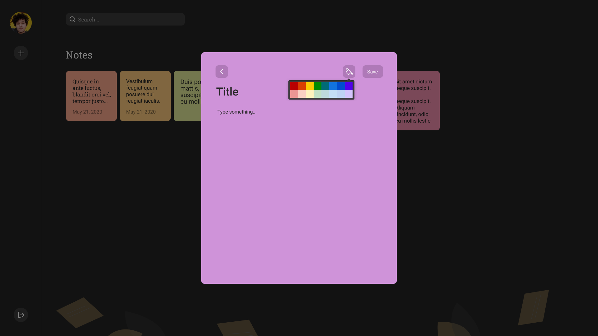
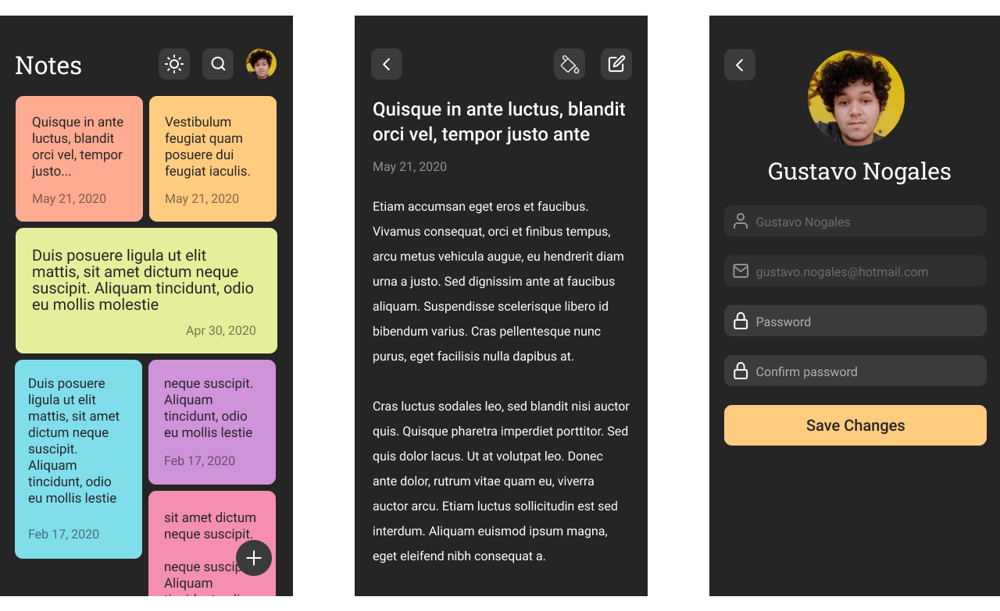

# React-Note

Aplicação web e mobile para anotações rápidas.


---

---

## Requisitos

- [NodeJS 12.*](https://nodejs.org/en/download/)
- [Yarn 1.*](https://yarnpkg.com/getting-started/install/)

## Tecnologias/Frameworks

- [Typescript](https://www.typescriptlang.org/)
- [React](https://github.com/facebook/react)
- [Express](https://expressjs.com/)
- [React-native](https://reactnative.dev/)
- [Celebrate](https://github.com/arb/celebrate/)
- [Cors](https://github.com/expressjs/cors/)
- [TypeORM](https://typeorm.io/#/)
- [Multer](https://github.com/expressjs/multer)
- [Axios](https://github.com/axios/axios)
- [Uuid](https://www.npmjs.com/package/uuid/)
- [Tsyringe](https://github.com/microsoft/tsyringe/)
- [Bcryptjs](https://www.npmjs.com/package/bcryptjs/)
- [jsonwebtoken](https://www.npmjs.com/package/jsonwebtoken/)
- [dotenv](https://github.com/motdotla/dotenv/)

<!-- ## Padrões de projeto

- *Clean Architecture* -->

## Execução API

Esse projeto utiliza PostgreSQL e Redis, para criar o banco e popular com seed execute os comandos na pasta api:
```
cp .env.example .env
yarn
docker-compose up -d
yarn typeorm migration:run
```
Para executar a API:

```shell script
yarn start
```

## Endpoints API

**URL**: http://localhost:3333

### User [All with berear token except POST]
- **[Create] Post:** /user
- **[Update Info] Put:** /user
- **[Update Avatar] Patch:** /user

### Session [SignIn]
- **[Create] Post:** /session

### Note  [All with berear token]
- **[Create] Post:** /note
- **[Show] Get:** /note
- **[Show] Get ID:** /note/{id}
- **[Delete] Delete:** /note/{id}
- **[Update Note] Put:** /note


Obs: Está disponível nesse repositório o arquivo json para importação no [Insomnia](https://insomnia.rest/download/).

<!-- ## Endpoints Web

- URL: http://localhost:3000/
- Session: http://localhost:3000/session
- User: http://localhost:3000/user -->
