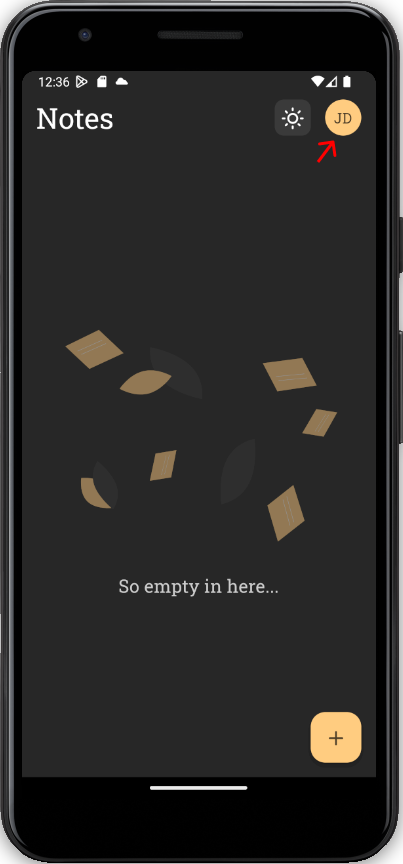
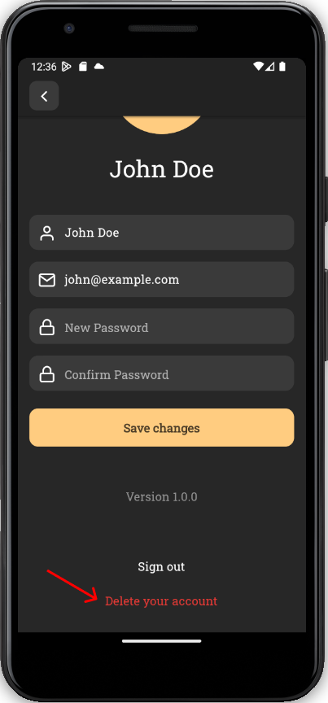
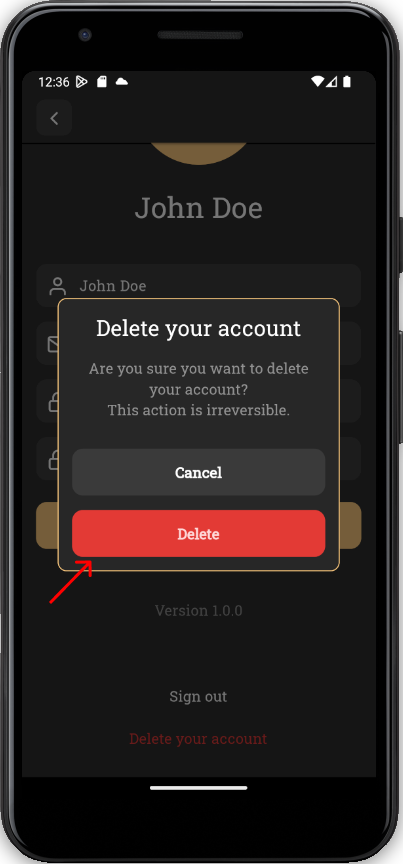

## Como deletar sua conta
Todos os seus dados pessoais (perfil e notas) serão deletados dos serviços.

1. Vá até seu perfil clicando no ícone do canto superior direito da tela inicial.

  

2. Role a tela até ver o botão "Delete your account"

    

3. Confirme clicando em "Delete" (Essa ação é irreversível).

    

